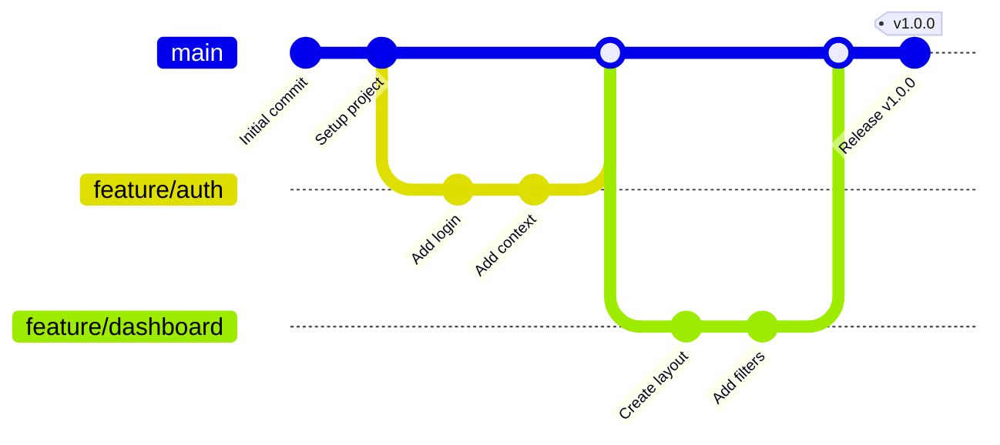

PROJETO INTEGRADOR II - GRUPO 004 - EIXO COMPUTAÇÃO - UNIVESP - 2025

Arquitetura:

A aplicação seguirá o padrão Full-Stack: a mesma base de código conterá o front-end e o back-end, facilitando o versionamento e o deploy contínuo.

* Front-End: React + Tailwind
* Back-end: Next.js + TypeScript
* Banco de Dados + Autenticação: Supabase e PostgreSQL
* Hospedagem e Deploy: Vercel
* Versionamento: Git + GitHub

ESTRUTURA DO PROJETO:


```
/
├── .github/                    # Configurações GitHub (workflows, templates)
├── public/                     # Arquivos estáticos
│   ├── favicon.ico
│   ├── placeholder.svg
│   └── robots.txt
├── src/                        # Código-fonte da aplicação
│   ├── components/             # Componentes React reutilizáveis
│   │   ├── Header.tsx
│   │   └── ui/                 # Componentes UI shadcn
│   ├── contexts/               # Contextos React (Auth)
│   ├── hooks/                  # Custom hooks
│   ├── integrations/           # Integrações externas
│   ├── lib/                    # Utilitários
│   ├── pages/                  # Páginas da aplicação
│   │   ├── Auth.tsx
│   │   ├── Dashboard.tsx
│   │   ├── TaskForm.tsx
│   │   ├── TaskDetail.tsx
│   │   ├── OsPrintPage.tsx
│   │   ├── Clients.tsx
│   │   └── Store.tsx
│   ├── types/                  # Definições TypeScript
│   ├── App.tsx                 # Componente raiz + rotas
│   ├── main.tsx                # Entry point
│   └── index.css               # Estilos globais
├── supabase/                   # Configurações backend (Supabase)
│   ├── config.toml             # Config auto-gerenciado
│   └── migrations/             # Migrações do banco de dados
├── .env                        # Variáveis de ambiente (NÃO comitar)
├── .gitignore                  # Arquivos ignorados pelo Git
├── package.json                # Dependências e scripts
├── react.config.ts              # Configuração React
├── tailwind.config.ts          # Configuração Tailwind CSS
├── tsconfig.json               # Configuração TypeScript
├── VERSION_CONTROL.md          # Este arquivo
├── CHANGELOG.md                # Histórico de mudanças
└── README.md                   # Documentação principal
```

---

## 3. Arquivos Ignorados (.gitignore)

O arquivo `.gitignore` está configurado para excluir:

**Logs e dependências:**
```
logs/
*.log
node_modules/
```

**Builds e distribuição:**
```
dist/
dist-ssr/
*.local
```

**Arquivos de configuração de editores:**
```
.vscode/ (exceto extensions.json)
.idea/
.DS_Store
*.suo, *.ntvs*, *.njsproj, *.sln, *.sw?
```

**⚠️ CRÍTICO**: O arquivo `.env` contém credenciais sensíveis e **NUNCA deve ser commitado**. É gerado automaticamente pelo Lovable Cloud.

---

## 4. Estratégia de Branches (Branching Strategy)

**Modelo**: **GitHub Flow Simplificado**



### Branches Principais:

**`main` (branch padrão)**
- Código de produção estável
- Sempre funcional e deployável
- Protegido contra pushes diretos
- Requer pull request + revisão para merge

**`develop` (opcional)**
- Branch de integração para desenvolvimento
- Recebe merges de feature branches
- Testes finais antes de merge para `main`

### Branches de Suporte:

**Feature Branches** (`feature/nome-da-feature`)
- Para desenvolvimento de novas funcionalidades
- Criadas a partir de `main` (ou `develop`)
- Nomenclatura: `feature/auth`, `feature/dashboard-filters`, `feature/pdf-generation`
- Exemplo:
  ```bash
  git checkout main
  git pull origin main
  git checkout -b feature/client-management
  ```

**Bugfix Branches** (`bugfix/descricao-do-bug`)
- Para correção de bugs não críticos
- Criadas a partir de `main` (ou `develop`)
- Exemplo: `bugfix/fix-date-validation`, `bugfix/pdf-encoding`

**Hotfix Branches** (`hotfix/descricao-urgente`)
- Para correções urgentes em produção
- Criadas a partir de `main`
- Merge direto para `main` e `develop`
- Exemplo: `hotfix/security-vulnerability`, `hotfix/critical-auth-bug`

---

## 5. Convenções de Commits (Conventional Commits)

Seguimos o padrão **Conventional Commits** para clareza e rastreabilidade.

### Formato:
```
<tipo>(<escopo>): <descrição curta>

[corpo opcional - descrição detalhada]

[rodapé opcional - issues relacionadas]
```

### Tipos de Commit:

| Tipo | Descrição | Exemplo |
|------|-----------|---------|
| `feat` | Nova funcionalidade | `feat(auth): add login page with validation` |
| `fix` | Correção de bug | `fix(dashboard): resolve date filter issue` |
| `docs` | Documentação | `docs(readme): add installation guide` |
| `style` | Formatação | `style(button): adjust padding` |
| `refactor` | Refatoração | `refactor(api): simplify queries` |
| `test` | Testes | `test(auth): add unit tests` |
| `chore` | Manutenção | `chore(deps): update dependencies` |
| `perf` | Performance | `perf(dashboard): optimize rendering` |
| `build` | Build | `build(vite): configure production` |
| `ci` | CI/CD | `ci(github): add deploy workflow` |

### Exemplos Práticos:

```bash
# Nova funcionalidade
git commit -m "feat(clients): add WhatsApp integration"

# Correção de bug
git commit -m "fix(os): prevent duplicate submissions"

# Documentação
git commit -m "docs(github): create version control docs"

# Com corpo e referência
git commit -m "fix(pdf): resolve character encoding

Portuguese special characters were displaying incorrectly.
Added UTF-8 meta tag to print page template.

Closes #42"
```

---

## 6. Fluxo de Trabalho Git (Workflow)

### 6.1 Configuração Inicial

```bash
# Clone o repositório
git clone <URL_DO_REPOSITORIO>
cd <NOME_DO_PROJETO>

# Configure seu nome e email
git config user.name "Seu Nome"
git config user.email "seu.email@exemplo.com"

# Instale dependências
npm install

# Inicie o servidor de desenvolvimento
npm run dev
```

### 6.2 Desenvolvendo uma Nova Feature

```bash
# 1. Atualize a branch main
git checkout main
git pull origin main

# 2. Crie uma nova feature branch
git checkout -b feature/nome-da-feature

# 3. Faça suas alterações e commits
git add .
git commit -m "feat(escopo): descrição"

# 4. Mantenha atualizada
git fetch origin
git rebase origin/main

# 5. Envie para o remoto
git push origin feature/nome-da-feature

# 6. Abra um Pull Request no GitHub
```

### 6.3 Revisão e Merge de Pull Request

**Checklist para Aprovação:**
- [ ] Código segue os padrões do projeto
- [ ] Commits seguem Conventional Commits
- [ ] Testes passam (se houver)
- [ ] Sem conflitos com `main`
- [ ] Funcionalidade testada manualmente
- [ ] Documentação atualizada (se necessário)
- [ ] RLS policies revisadas (se mudanças no banco)

**Fluxo de Merge:**
```bash
# Após aprovação do PR
git checkout main
git pull origin main
git merge --no-ff feature/nome-da-feature
git push origin main

# Delete a branch
git branch -d feature/nome-da-feature
git push origin --delete feature/nome-da-feature
```

### 6.4 Hotfix Urgente

```bash
# 1. Crie branch a partir de main
git checkout main
git pull origin main
git checkout -b hotfix/descricao-urgente

# 2. Faça a correção
git add .
git commit -m "hotfix(escopo): descrição"

# 3. Merge direto (após revisão rápida)
git checkout main
git merge --no-ff hotfix/descricao-urgente
git push origin main

# 4. Se houver develop, merge também
git checkout develop
git merge --no-ff hotfix/descricao-urgente
git push origin develop

# 5. Delete a branch
git branch -d hotfix/descricao-urgente
```

---

## 7. Integração com Lovable

Este projeto utiliza **sincronização bidirecional** entre Lovable e GitHub:

### 7.1 Lovable → GitHub (Automático)
- Mudanças no editor Lovable são automaticamente commitadas
- Commits automáticos seguem padrão do Lovable
- Não requer push manual

### 7.2 GitHub → Lovable (Automático)
- Mudanças locais ou via GitHub sincronizam em tempo real
- Permite desenvolvimento simultâneo
- Útil para trabalho em equipe

### 7.3 Desenvolvimento Paralelo

```bash
# Desenvolvedor Local
git checkout -b feature/nova-funcionalidade
# Faz alterações...
git commit -m "feat: add new feature"
git push origin feature/nova-funcionalidade
# Abre PR

# Desenvolvedor no Lovable
# Trabalha em outra feature no Lovable
# Mudanças são commitadas automaticamente

# Ambos fazem merge via PR
```

### 7.4 Branches no Lovable

⚠️ **RECURSO EXPERIMENTAL**: Lovable tem suporte limitado para branches.

**Para habilitar:**
1. Acesse **Account Settings > Labs**
2. Ative **GitHub Branch Switching**
3. Alterne branches diretamente no Lovable

---

## 8. Tags e Releases

### 8.1 Versionamento Semântico (SemVer)

Seguimos **MAJOR.MINOR.PATCH**:

- **MAJOR** (v2.0.0): Mudanças incompatíveis
- **MINOR** (v1.1.0): Novas funcionalidades compatíveis
- **PATCH** (v1.0.1): Correções de bugs

### 8.2 Criando uma Release

```bash
# 1. Atualize a versão
npm version minor  # ou major/patch

# 2. Crie uma tag
git tag -a v1.1.0 -m "Release v1.1.0 - Add feature"

# 3. Envie a tag
git push origin v1.1.0

# 4. Crie Release no GitHub
# GitHub > Releases > Draft a new release
```

### 8.3 Formato de Release Notes

```markdown
## v1.1.0 - Feature Name (2025-01-15)

### ✨ Novas Funcionalidades
- feat(clients): add client registration

### 🐛 Correções
- fix(pdf): resolve encoding issues

### 📚 Documentação
- docs(github): add version control

### 🔧 Melhorias
- refactor(api): optimize queries

### ⚠️ Breaking Changes
Nenhuma.
```

---

## 9. Boas Práticas

### 9.1 Commits
✅ **Faça:**
- Commits pequenos e atômicos
- Mensagens descritivas
- Commits frequentes
- Teste antes de commitar

❌ **Evite:**
- Commits gigantes
- Mensagens vagas
- Commitar código quebrado
- Commitar arquivos sensíveis

### 9.2 Pull Requests
✅ **Faça:**
- Descrição clara
- Referências a issues
- Screenshots de mudanças visuais
- Testes manuais

❌ **Evite:**
- PRs gigantes
- PRs sem descrição
- Merge sem revisão
- PRs antigos abertos

### 9.3 Branches
✅ **Faça:**
- Nomes descritivos
- Delete após merge
- Mantenha atualizadas
- Use rebase

❌ **Evite:**
- Nomes genéricos
- Acumular branches antigas
- Trabalhar direto na `main`
- Force push em branches compartilhadas

### 9.4 Segurança
✅ **Faça:**
- Use `.gitignore` para `.env`
- Revise código antes de commitar
- Use secrets do GitHub
- Mantenha dependências atualizadas

❌ **Evite:**
- Commitar senhas/tokens
- Expor credenciais
- Ignorar avisos de segurança
- Dependências desatualizadas

---

## 10. Resolução de Conflitos

### 10.1 Conflitos de Merge

```bash
# Conflito ao fazer merge
git checkout main
git pull origin main
git checkout feature/minha-feature
git merge main

# CONFLICT detectado
# Edite arquivos manualmente
# Procure: <<<<<<<, =======, >>>>>>>

# Após resolver
git add .
git commit -m "merge: resolve conflicts"
git push origin feature/minha-feature
```

### 10.2 Conflitos de Rebase

```bash
# Rebase com conflitos
git fetch origin
git rebase origin/main

# CONFLICT - resolva manualmente

# Continue
git add .
git rebase --continue

# Ou aborte
git rebase --abort
```

---

## 11. CI/CD (GitHub Actions)

### 11.1 Workflow Sugerido

**Arquivo:** `.github/workflows/ci.yml`

```yaml
name: CI/CD Pipeline

on:
  push:
    branches: [ main, develop ]
  pull_request:
    branches: [ main ]

jobs:
  build:
    runs-on: ubuntu-latest
    
    steps:
    - uses: actions/checkout@v3
    
    - name: Setup Node.js
      uses: actions/setup-node@v3
      with:
        node-version: '18'
    
    - name: Install dependencies
      run: npm ci
    
    - name: Run linter
      run: npm run lint
    
    - name: Build project
      run: npm run build
    
    - name: Deploy to Lovable
      if: github.ref == 'refs/heads/main'
      run: echo "Deploy via Lovable"
```

### 11.2 Hooks Git Locais

**Pre-commit Hook** (`.git/hooks/pre-commit`):
```bash
#!/bin/bash
# Evita commits de .env
if git diff --cached --name-only | grep -q "^.env$"; then
  echo "❌ Erro: .env detectado!"
  exit 1
fi

npm run lint
```

---

## 12. Colaboração em Equipe

### 12.1 Code Review

**Checklist do Revisor:**
- [ ] Código legível e documentado?
- [ ] Segue padrões do projeto?
- [ ] Sem vulnerabilidades?
- [ ] RLS policies corretas?
- [ ] Funcionalidade testada?
- [ ] Commits seguem padrão?

**Feedback Construtivo:**
```markdown
# ✅ Bom
"Sugiro extrair para um hook customizado."

# ❌ Ruim
"Código horrível."
```

### 12.2 Template de PR

**Arquivo:** `.github/pull_request_template.md`

```markdown
## Descrição
Breve descrição das mudanças.

## Tipo de Mudança
- [ ] Nova funcionalidade
- [ ] Correção de bug
- [ ] Refatoração
- [ ] Documentação

## Checklist
- [ ] Código segue padrões
- [ ] Commits convencionais
- [ ] Testado manualmente
- [ ] Documentação atualizada

## Screenshots
Cole screenshots.

## Issues Relacionadas
Closes #123
```

---

## 13. Comandos Git Úteis

```bash
# Histórico visual
git log --oneline --graph --all

# Ver mudanças
git status
git diff

# Desfazer último commit (mantém mudanças)
git reset --soft HEAD~1

# Desfazer último commit (descarta)
git reset --hard HEAD~1

# Alterar mensagem do último commit
git commit --amend -m "nova mensagem"

# Limpar arquivos não rastreados
git clean -fd

# Ver branches remotas
git branch -r

# Atualizar lista de branches
git fetch --prune

# Criar branch de commit específico
git checkout -b nova-branch abc1234

# Aplicar commit específico
git cherry-pick abc1234

# Ver quem modificou cada linha
git blame arquivo.tsx

# Buscar no histórico
git log --grep="texto"

# Reverter commit
git revert abc1234
```

---

## 14. Troubleshooting

### Conflito complexo
```bash
# Abortar e tentar rebase
git merge --abort
git rebase origin/main

# Aceitar versão específica
git checkout --theirs arquivo.tsx
git checkout --ours arquivo.tsx
```

### Commitei .env por engano
```bash
# Remover (ANTES de push)
git rm --cached .env
git commit --amend

# Se já fez push (CUIDADO)
git filter-branch --tree-filter 'rm -f .env' HEAD
git push --force
```

### Branch divergiu
```bash
# Ver diferenças
git fetch origin
git log HEAD..origin/main

# Sincronizar
git pull --rebase origin main
```

---

## 15. Recursos Adicionais

**Documentação:**
- [Git Official Docs](https://git-scm.com/doc)
- [GitHub Docs](https://docs.github.com)
- [Lovable Docs](https://docs.lovable.dev)

**Ferramentas:**
- [GitKraken](https://www.gitkraken.com/) - Cliente visual
- [GitHub Desktop](https://desktop.github.com/) - Cliente oficial
- [GitLens](https://gitlens.amlcode.com/) - Extensão VSCode

**Aprendizado:**
- [Learn Git Branching](https://learngitbranching.js.org/)
- [Conventional Commits](https://www.conventionalcommits.org/)
- [SemVer](https://semver.org/)

---

## 16. Contato e Suporte

**Equipe**: PRJ INTEGRADOR - GRUPO 04 - UNIVESP - 2025

**Dúvidas sobre Git/GitHub:**
- Abra uma issue com label `question`

**Bugs de versionamento:**
- Abra uma issue com labels `git` e `bug`

---

## 17. Changelog

Consulte [CHANGELOG.md](./CHANGELOG.md) para histórico detalhado de todas as mudanças do projeto.

---

**Última atualização:** 2025-01-15  
**Versão do documento:** 1.0.0
